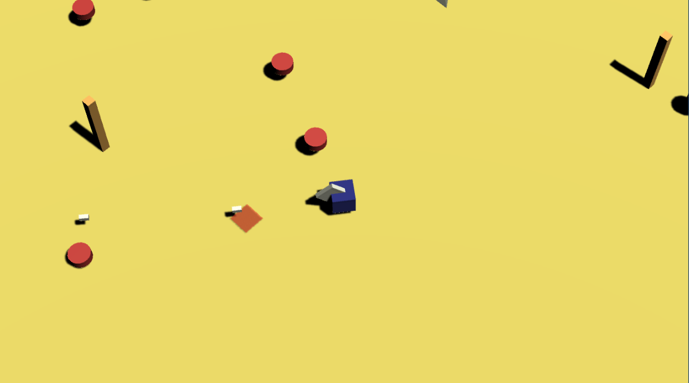

# Unity + NCMB デモ 見下ろし型シューティングゲーム

## これは何？
Unityと[ニフティクラウド mobile backend](http://mb.cloud.nifty.com/)のデモです。
見下ろし型シューティングゲームに非同期型のオンライン機能を導入しています。

Unity 5.5.1f, NCMB SDK for Unity 2.2.0で作成しています。

実行ファイル：

## 操作とデモの流れ
* WASDまたは方向キーで移動、マウスで照準、クリックで弾発射
* プレイヤーはゲームスタート時、やられたときのコメントを設定できる
* プレイヤーがやられた場所にコメントが残され、オンラインでほかのプレイヤーと共有される
* 他のプレイヤーの亡骸に触れるとコメントが表示され、仲間にできる

デモの動作にはニフティクラウド mobile backendのアカウント取得とAPIキー設定が必要です。
手順については[こちら](http://mb.cloud.nifty.com/doc/current/introduction/quickstart_unity.html)。

